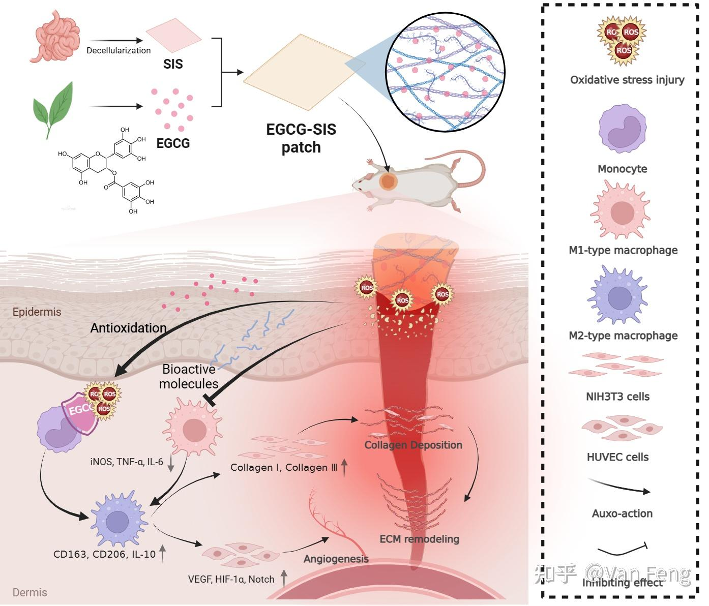
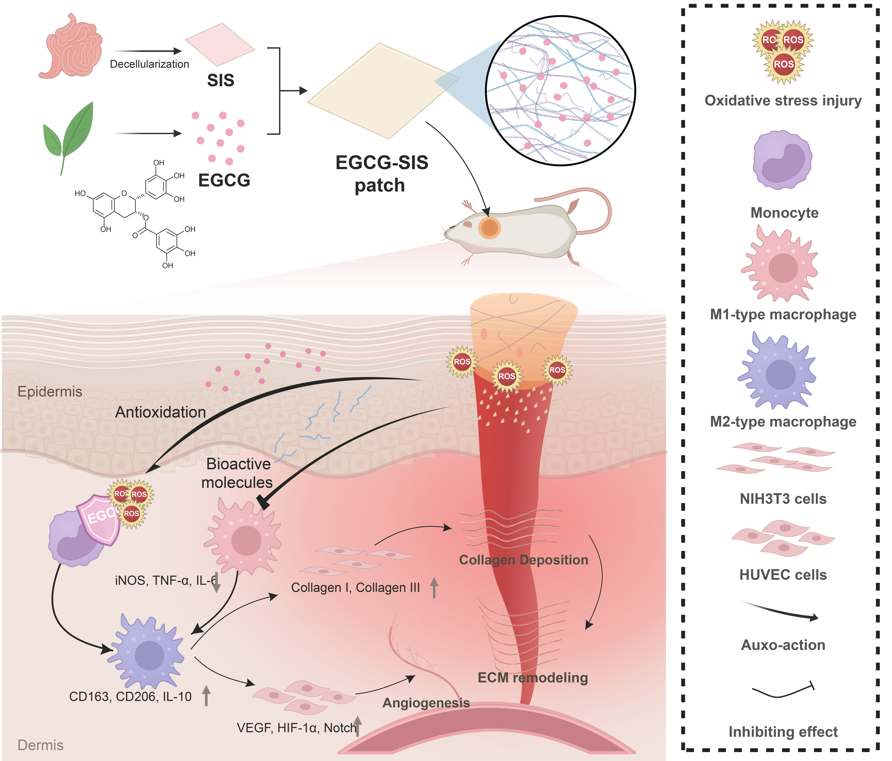
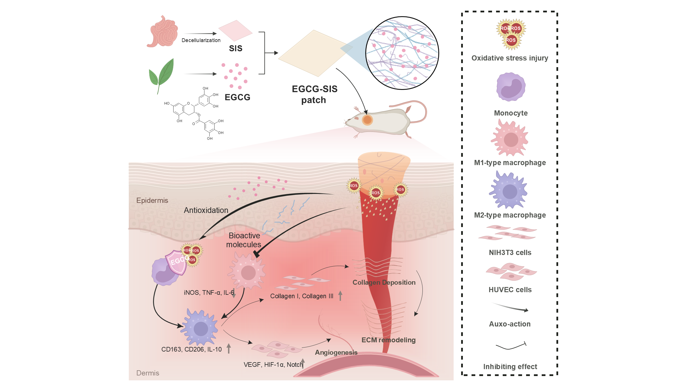
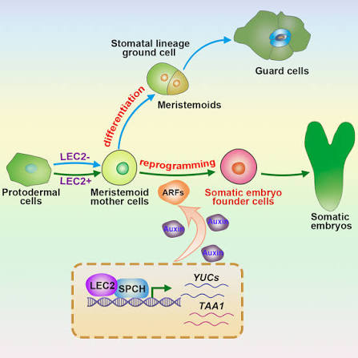
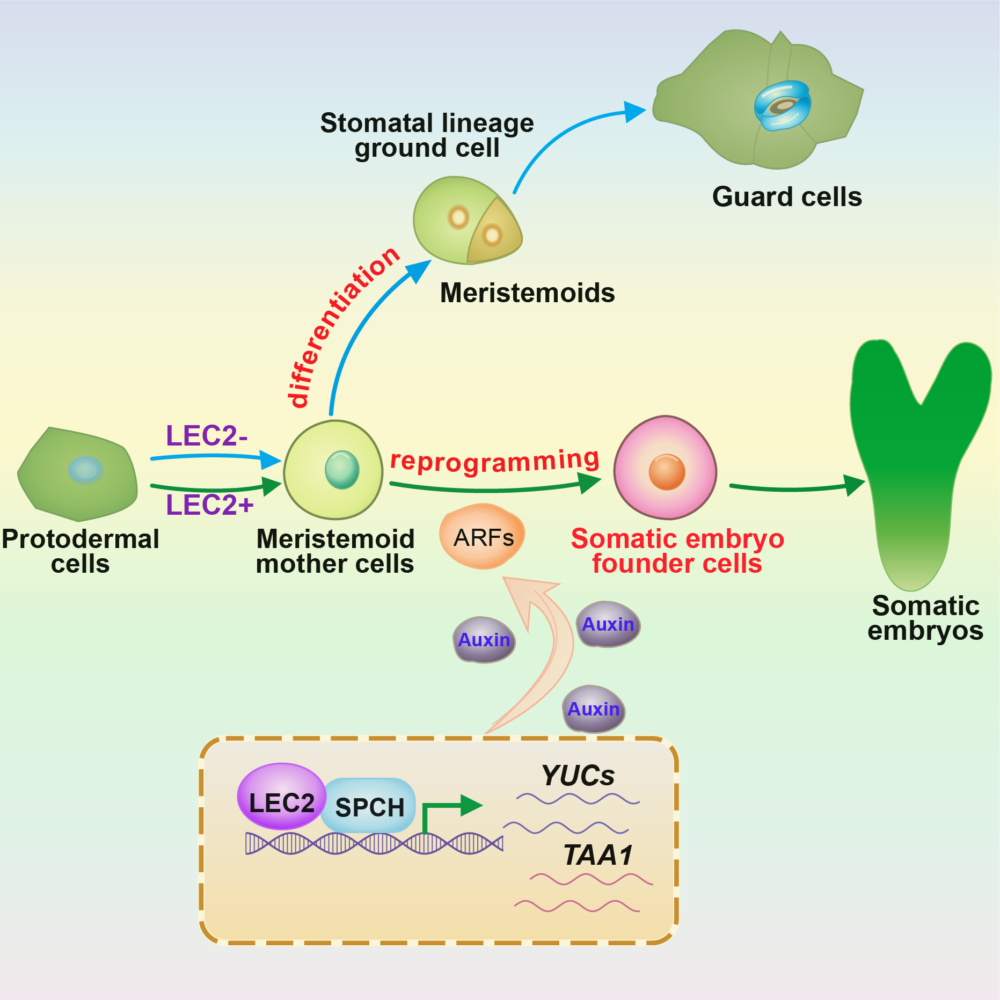

# Scientific Vector Studio

将 PNG、JPEG、TIFF 或 WebP 科研示意图重建为可编辑矢量图，并同步到 Adobe Illustrator 或 PowerPoint。

SVS 根据参考图重建可编辑的图形和文字，保留布局、颜色及所需的渐变和透明度，并根据用户选择，将绘制结果同步到 Adobe Illustrator 或 PowerPoint，供查看和继续编辑。

## 下载与安装

### Codex 一句话安装（推荐）

在 Codex 本地任务中发送：

> 请使用 skill-installer 安装这个 Skill：https://github.com/Gucase/svs-download/tree/main/scientific-vector-studio ，并安装 requirements.txt 中的依赖。

标准安装器会把 `scientific-vector-studio/` 安装到当前用户的 `$CODEX_HOME/skills`（未设置时通常为 `.codex/skills`）。安装完成后，Skill 会在下一轮对话中可用。Python 依赖安装会单独请求用户批准，这是正常的安全机制。

使用前请自行打开 Adobe Illustrator 2026（30.x）或 PowerPoint 及目标文档。

## 环境要求

| 项目 | 要求 | 安装器处理方式 |
|---|---|---|
| Windows | Windows 10/11，PowerShell 5.1 或更高 | 系统自带，不修改系统设置 |
| Codex | 支持本地 Skill 的 Codex 桌面环境 | 用户预先安装 |
| Python | Python 3.8 或更高，带 `pip` | 自动检测；缺失时停止并给出提示 |
| Python 包 | `cryptography`、`fonttools`、`numpy`、`Pillow` | 自动通过 `requirements.txt` 安装 |
| Illustrator | Adobe Illustrator 2026 / 30.x | 用户自行安装并打开，仅使用 Illustrator 时需要 |
| PowerPoint | 支持 SVG 的桌面版 PowerPoint | 用户自行安装并打开，仅使用 PPT 时需要 |

安装器不会静默安装 Python、Adobe Illustrator、Microsoft Office 或 Codex，也不会关闭、启动或修改这些应用。

## 基本用法

1. 在 Codex 中附上 PNG、JPEG、TIFF 或 WebP 参考图。
2. 说明希望同步到 Illustrator、PowerPoint，或两者都需要。
3. 自行打开目标应用和文档，再让 Codex 使用 `scientific-vector-studio` 重建。
4. Skill 测量原图的布局、轮廓、文字和连接关系，直接构建可编辑路径与文本，对照原图调整细节。
5. Illustrator 通过原生 SVG 导入器打开绘制结果，根据参考图需要使用纯色、渐变、透明度或纯矢量裁剪；PPT 从同一测量场景生成兼容版本，转换后单独检查。
6. 在应用中查看工作稿并确认效果。你确认“这一版可以了”后，当前视觉版本即按已验收处理；如需保存 AI 文件，再指定保存位置。

例如：

> 使用 scientific-vector-studio，在我已经打开的 Illustrator 中按这张参考图直接绘制可编辑矢量。不要自动图像描摹，保留可编辑图形和文字，逐项对照细节，完成后让我查看。

## 实际工作流

**读取参考图 → 测量布局和细节 → 直接绘制图形和文字 → 结构校验 → 原图与局部对照 → 修正 → 在 Illustrator 或 PowerPoint 中查看 → 用户确认。**

根据参考图直接绘制可编辑矢量，保留图形布局、文字标注、连接关系及关键细节。纯色、渐变和透明度按参考图需要使用。绘制后与原图进行整体和局部比较，调整图形位置、轮廓、曲线和颜色。

根据用户选择，将绘制结果呈现在 Illustrator 或 PowerPoint 中，供查看和继续编辑。不同应用对渐变和图形的支持可能不同，转换后会分别检查效果。

用户确认当前绘制结果后，即完成视觉验收；如需保存或导出，可进一步指定文件格式和保存位置。

## 绘制示例

以下按示例依次展示原图及绘制结果。

### 示例一｜EGCG-SIS

#### 原图｜非矢量参考图



<sub>图来源于网络。</sub>

#### 在 Illustrator 中绘制的可编辑矢量图效果预览



#### 在PowerPoint中绘制的可编辑矢量图效果预览



*注：第二、三张为矢量绘制结果的 PNG 预览，PNG 本身不是矢量文件。PowerPoint 预览保留了幻灯片画布的留白。*

### 示例二｜气孔谱系与体细胞胚发生

#### 原图｜非矢量参考图



<sub>图来源于网络。</sub>

#### 在 Illustrator 中绘制的可编辑矢量图效果预览



*注：第二张为 Illustrator 矢量绘制结果的 PNG 预览，PNG 本身不是矢量文件。*

## 免费体验与买断

- 免费体验 1 张完整绘图。
- 同一原图和科研目标下的技术失败重试、对照原图纠错，以及同步到 Illustrator/PPT，不重复占用免费次数。
- 更换原图、增加新的科研内容/面板，或制作实质不同的构图，试用期间按一张新图计次。
- **39 元一次买断，绑定一台电脑，SVS 不限绘图次数；同机 Illustrator／PowerPoint 共用授权。**
- 不限次仅指 SVS 授权，不包含 Codex 第三方使用额度。
- 欢迎关注“队长的生物实验室”微信公众号/小红书。
- 添加队长的笔记本微信（`XBBen01`），购买 SVS 买断授权文件。


| 方案 | 价格 | 绘图次数 |
|---|---:|---|
| 免费体验 | 0 元 | 1 张 |
| 个人买断 | 39 元 | 授权一台电脑，SVS 不限次 |

购买前先安装 Skill，让 Codex 获取本机机器码：

> 请使用 SVS 获取这台电脑的机器码。

或在 PowerShell 中运行以下两行：

```powershell
[Console]::OutputEncoding = [System.Text.UTF8Encoding]::new($false)
& "$env:USERPROFILE\.codex\skills\scientific-vector-studio\scripts\get_machine_code.ps1"
```

第一行将当前终端的输出编码设为 UTF-8，避免中文输出导致解析报错，不修改授权状态。

将输出的 `SVS-MACHINE-1.` 开头的完整机器码和订单编号发给队长；无需发送原始设备标识或科研图片。购买后会收到绑定该电脑的 `.svslicense` 授权文件。无需注册账号，将文件交给 Codex，并说：

> 请使用 SVS 导入这个买断授权文件，并检查是否已解锁无限次绘图。

状态显示 `unlimited: true` 和 `machine_bound: true` 即已解锁。同机重复导入不会重复计费；直接复制文件或授权记录到机器码不同的电脑将无法使用。若自定义了 `CODEX_HOME`，请使用实际 Skill 安装路径。

## 隐私与安全

参考图默认只在本机处理，不会把未公开科研图片上传到第三方服务。
